# Лабораторная работа №1 — Ansible

## 1. Разработка роли без использования сторонних ролей

В этой лабе я собирал роль opensearch для установки OpenSearch и OpenSearch Dashboards версии 3.8.0. Работал в репозитории IaC, в ветке lab-1. Логику разложил по задачам установки, настройки и проверки, а для выполнения использовал стандартные модули Ansible: apt, command, assert и uri. Они выполняют отдельные операции внутри роли, поэтому использовать их — как раз не изобретать велосипед с собственными скриптами на каждый чих.

На скриншотах показаны структура моей роли и фрагменты её реализации. Полного содержимого проекта в приложенном архиве нет, поэтому отдельно проверить отсутствие подключённых сторонних ролей по этим материалам нельзя. Ход работы зафиксирован на скриншоте 2, скриншоте 6 и скриншоте 11.

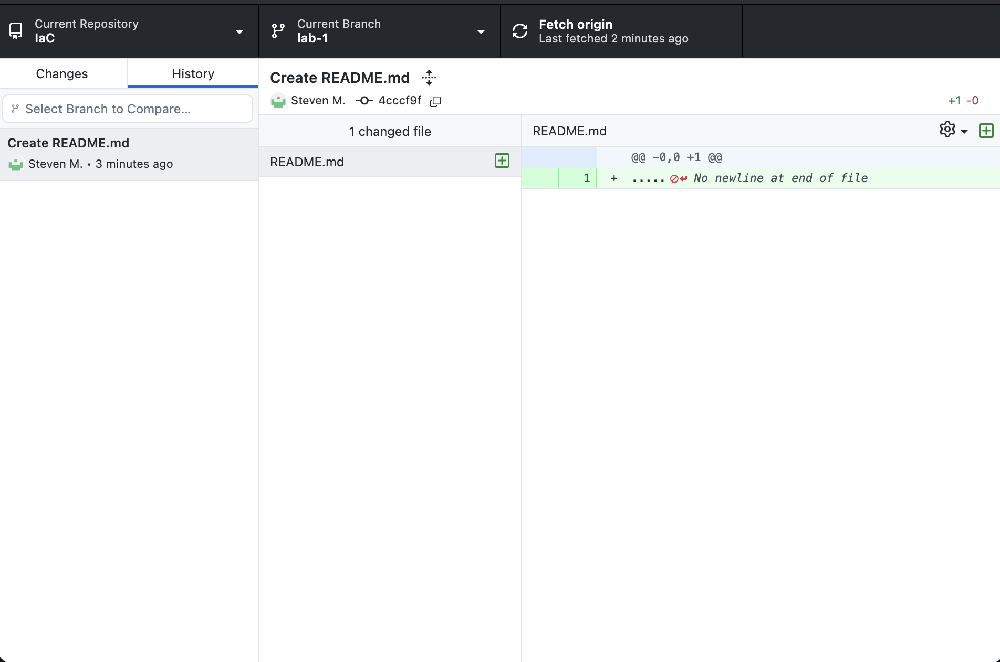

## 2. Установка непосредственно на Linux-машину

Стенд я поднял через Multipass: создал виртуалку iac-lab1 с Ubuntu 24.04, выделил два ядра, четыре гига оперативки и двадцать гигов диска. Для этого использовал команду multipass launch 24.04 --name iac-lab1 --cpus 2 --memory 4G --disk 20G. Затем через multipass list и multipass info iac-lab1 проверил, что машина запущена и получила адрес 192.168.252.2. Внутри стояла Ubuntu 24.04.5 LTS на архитектуре aarch64, с systemd 255. Создание и проверка ВМ показаны на скриншоте 3 и скриншоте 4.

Ansible запускал со своего Mac, а пакеты устанавливал прямо в Ubuntu через apt. Docker и контейнеры в показанной схеме не использовались: целевой системой была сама виртуалка. Перед деплоем проверил SSH-подключение через модуль ping с пользователем ubuntu и своим ключом, а после настройки inventory выполнил ansible opensearch -m ping. Хост opensearch-node вернул pong — коннект есть, можно катить дальше. Это видно на скриншоте 5 и скриншоте 7.

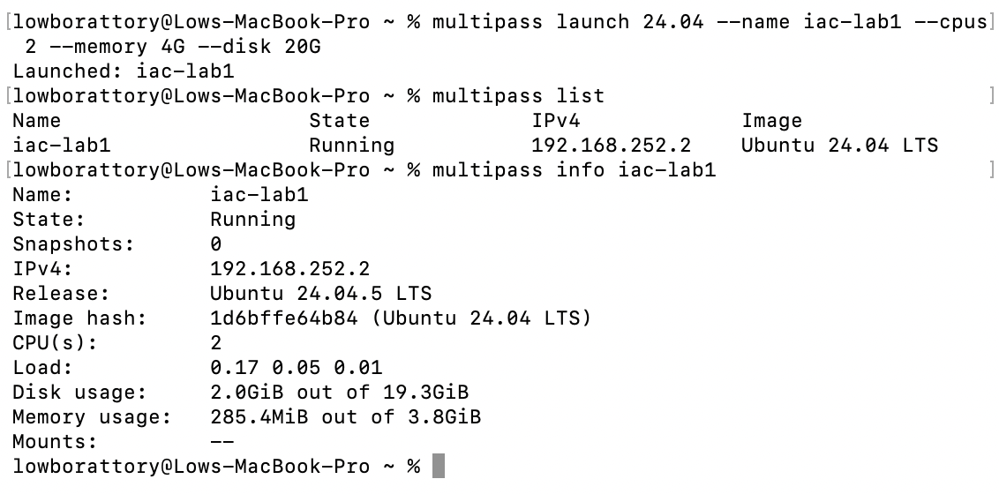

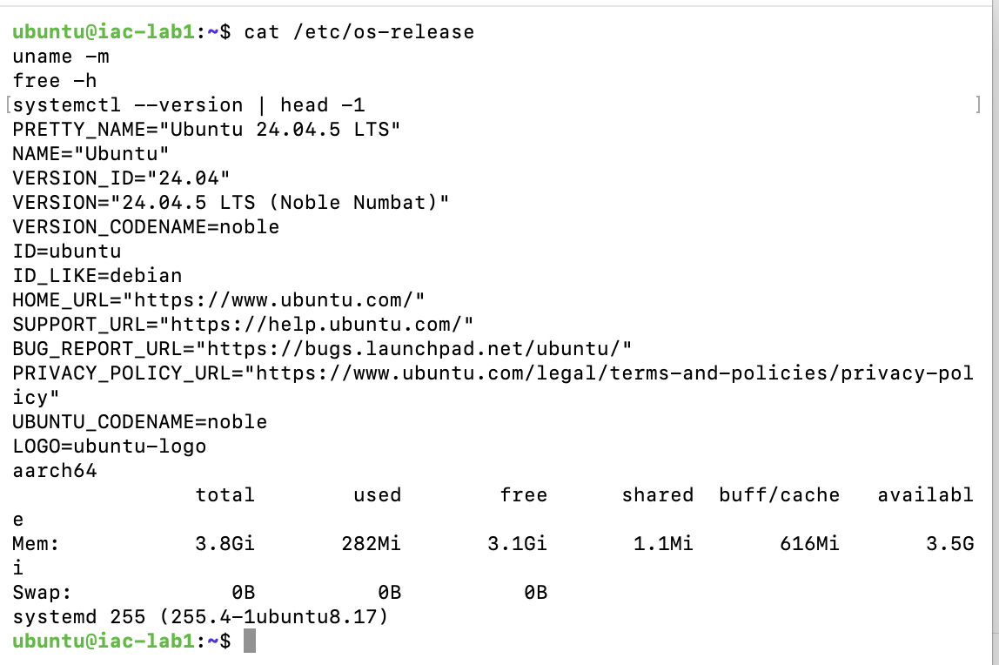

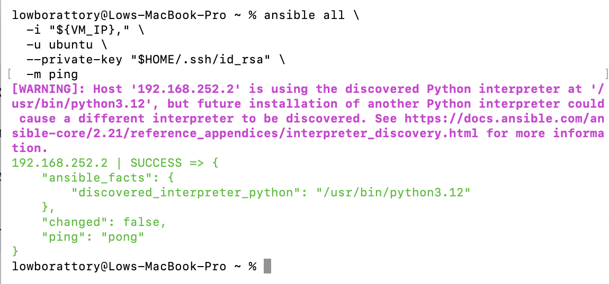

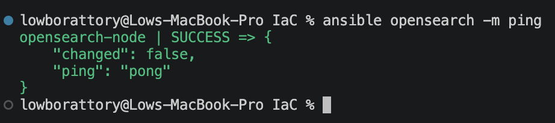

## 3. Стандартные директории роли

Роль разместил в roles/opensearch. В defaults вынес пользовательские настройки по умолчанию, в files положил файлы пакетных репозиториев, в templates — шаблоны конфигов, а в tasks — задачи. На актуальном скриншоте проекта задачи уже разделены на подготовку репозитория и системы, установку, настройку и проверку каждого сервиса. Так проще ориентироваться в проекте, а не искать нужную таску к чёрту на куличики внутри одного огромного файла.

В структуре также присутствуют handlers, meta, tests и vars. При этом сам факт наличия папок ещё не доказывает выполнение третьего требования: по заданию они должны содержать работающую логику или данные по назначению. На предоставленных скриншотах содержимое meta, tests и vars, а также код handlers не раскрыты, поэтому их функциональное наполнение остаётся проверить по исходникам. Структура и список файлов показаны на скриншоте 6, скриншоте 8 и скриншоте 9.

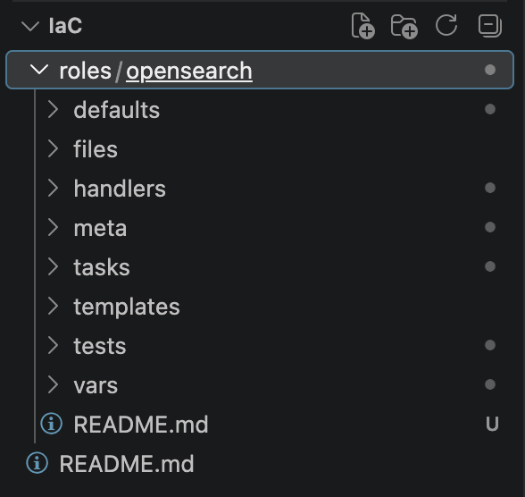

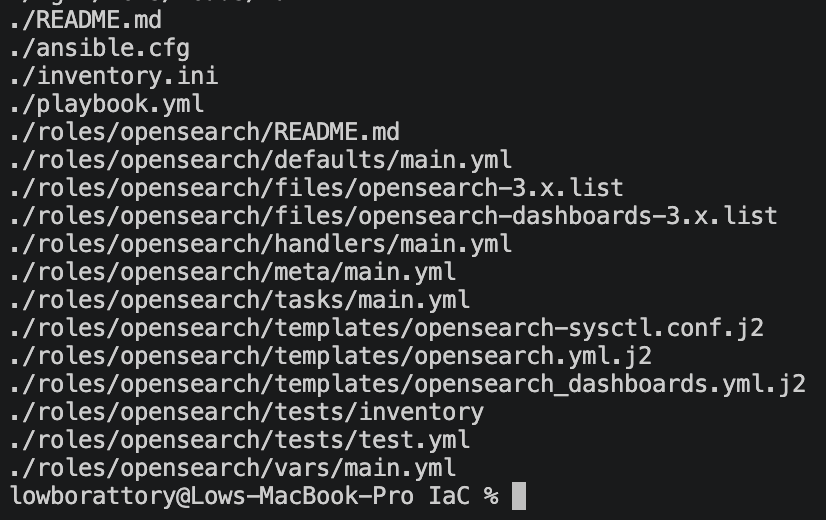

## 4. Установка заданной версии, настройка системы и запуск

Версию OpenSearch зафиксировал на 3.8.0 и передал её в задачу установки через модуль apt. После установки добавил проверку через dpkg-query: получал версию пакета и сравнивал её с ожидаемой с помощью assert. То есть проверял конкретный результат, а не просто надеялся, что пакетный менеджер поставил что-нибудь подходящее. Подготовил файлы репозиториев обоих продуктов и шаблон системной настройки vm.max_map_count со значением 262144. Задача установки и проверка версии показаны на скриншоте 11, настройки роли — на скриншоте 8.

Для OpenSearch выбрал режим single-node и отключил Security-плагин в конфигурации учебного стенда. После настройки сервис запускался через роль. Проверка подтвердила установку OpenSearch 3.8.0, а позднее — и Dashboards 3.8.0. Результаты есть на скриншоте 14 и скриншоте 15. Полный перечень устанавливаемых зависимостей и фактическое применение системного параметра на скриншотах не раскрыты, поэтому эту часть требования нужно дополнительно сверить с задачами роли.

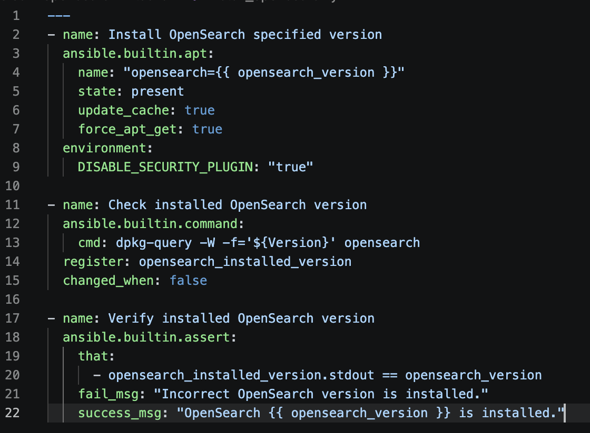

## 5. Параметризация роли и значения по умолчанию

Основные настройки вынес в defaults, чтобы менять стенд без редактирования самих тасок и шаблонов. Параметр opensearch_version задаёт версию, по умолчанию 3.8.0; opensearch_cluster_name — имя кластера opensearch-lab; opensearch_node_name берёт имя хоста из inventory. Версию удобно фиксировать для повторяемого деплоя, а имена менять под конкретное окружение. Параметры opensearch_network_host и opensearch_http_port по умолчанию равны 127.0.0.1 и 9200: в таком сетапе API OpenSearch слушает локальный интерфейс виртуалки.

Для Dashboards предусмотрел opensearch_dashboards_host со значением 0.0.0.0 и opensearch_dashboards_port со значением 5601, чтобы веб-сервис слушал сетевые интерфейсы ВМ. Системный параметр вынес в opensearch_vm_max_map_count со значением 262144. За ожидание готовности отвечают opensearch_readiness_retries и opensearch_readiness_delay: по умолчанию двенадцать повторных попыток с паузой пять секунд. Это позволяет менять время ожидания под скорость машины, а не хардкодить его в каждой проверке. Значения показаны на скриншоте 8.

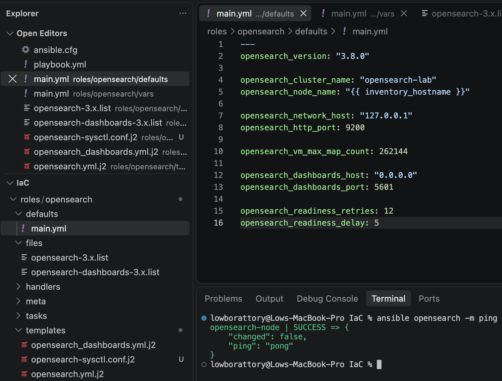

## 6. Конфигурационные файлы через Jinja2

Конфиги оформил шаблонами Jinja2, чтобы Ansible подставлял в них значения переменных. В шаблоне OpenSearch использовал имя кластера и ноды, пути к данным и логам, адрес прослушивания и HTTP-порт. Режим single-node и отключение Security-плагина в показанном шаблоне заданы непосредственно. Шаблон виден на скриншоте 12.

Отдельно подготовил шаблоны для Dashboards и системной настройки. Так конфигурация хранится вместе с ролью, и её не приходится каждый раз вручную копипастить на виртуалку. В результатах запуска задачи применения шаблонов OpenSearch и Dashboards завершились успешно — это показано на скриншоте 14 и скриншоте 15.

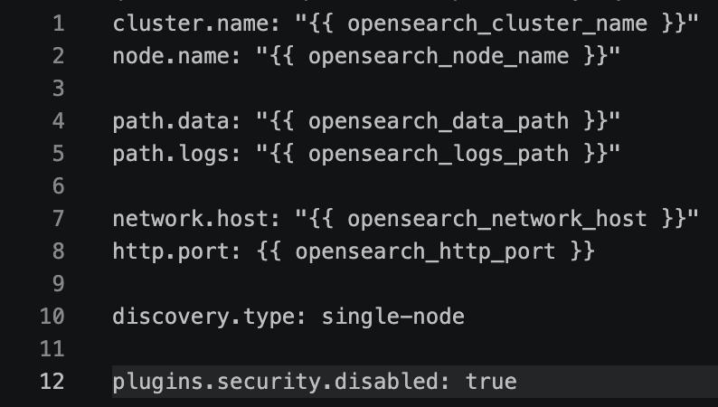

## 7. Применение изменений через handlers

Для применения изменений в проекте предусмотрена директория handlers. В выводе запусков присутствуют отдельные этапы применения ожидающих обработчиков для OpenSearch и Dashboards. Смысл такой схемы — перезапускать сервис после изменения его настроек, когда это действительно требуется, чтобы деплой не дёргал его просто ради движухи.

На повторном прогоне изменений не было, и итоговый счётчик changed остался нулевым. Однако код обработчиков и их вызов через notify на скриншотах не показаны, а отдельного эксперимента с изменением конфига нет. Поэтому повторный запуск подтверждает отсутствие изменений в показанном сценарии, но для полной проверки этого пункта нужно посмотреть связи задач с handlers и проверить реакцию на изменение шаблона. Вывод запусков есть на скриншоте 14 и скриншоте 15.

## 8. Автоматический запуск после перезагрузки

После настройки OpenSearch я отдельно проверил его состояние средствами systemctl через Ansible. Выполнил ansible opensearch -b -m command -a "systemctl is-active opensearch", затем ansible opensearch -b -m command -a "systemctl is-enabled opensearch". Получил active и enabled: сервис работает и включён в автозагрузку. Результат показан на скриншоте 14.

У этих вызовов модуль command вывел CHANGED, но сами команды только читали состояние сервиса. Поэтому считать это реальным изменением настроек не стоит. Автозагрузка подтверждена ответом enabled; перезагрузка виртуалки с последующей проверкой на предоставленных скриншотах не показана.

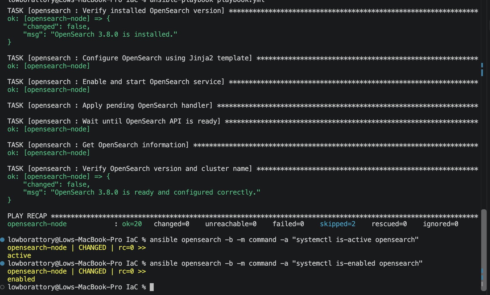

## 9. Проверка готовности OpenSearch через API

Чтобы не проверять сервис через пень колоду сразу после его запуска, добавил ожидание готовности через модуль uri. Он обращается к API состояния кластера и проверяет успешный HTTP-ответ с кодом 200, а также статус green или yellow. Количество повторных попыток ограничено параметром роли, между ними предусмотрена пауза. Затем отдельным запросом получаю информацию OpenSearch и сверяю версию и имя кластера. Логика этих проверок показана на скриншоте 13.

В выводе запуска проверка завершилась успешно: OpenSearch 3.8.0 готов и настроен правильно. Для Dashboards тоже показаны успешное ожидание API и проверка его версии. Это уже подтверждает, что сервисы отвечают на запросы, а не просто числятся установленными пакетами. Результаты зафиксированы на скриншоте 14 и скриншоте 15.

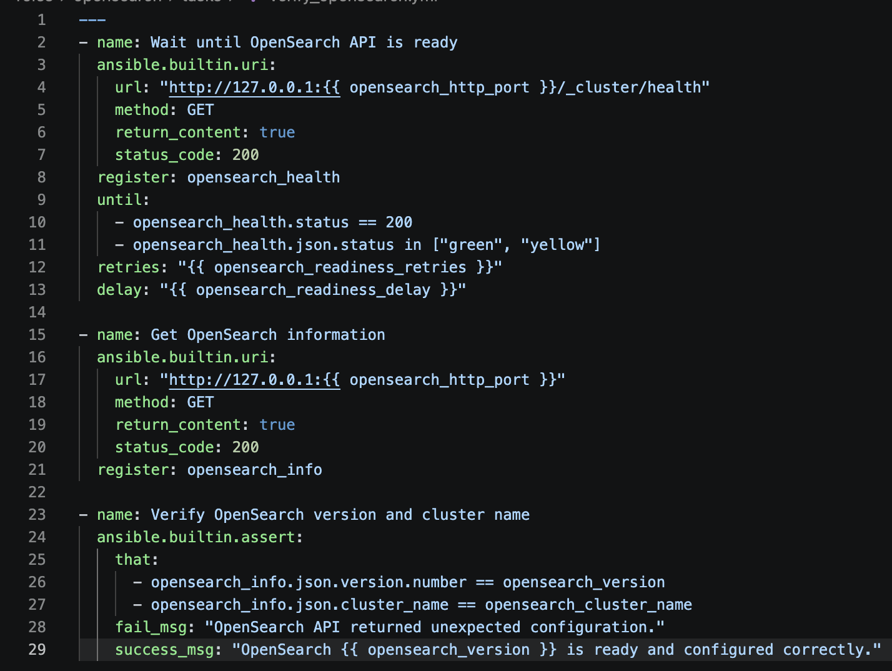

## 10. Окружение, команды запуска и итог проверки

Управляющей машиной был Mac с macOS 26.6.2 и архитектурой arm64, Ansible Core 2.21.4 использовал Python 3.14.7. Окружение проверял командами sw_vers, uname -m и ansible --version, результат есть на скриншоте 1. Перед деплоем запускал ansible-playbook --syntax-check playbook.yml, затем ansible-playbook playbook.yml. Первый показанный прогон проверял только факты и подходящую ОС, поэтому его две успешные задачи ещё не означали полный деплой. Тогда же вылезли предупреждения об устаревающем обращении к фактам; на первом подключении был warning про автоматически найденный Python. Эти предупреждения выполнение не сломали, но их исправление на скриншотах не зафиксировано. Ранний запуск показан на скриншоте 10.

После настройки обоих сервисов повторно запустил ANSIBLE_NOCOLOR=1 ansible-playbook playbook.yml 2>&1 | tee artifacts/lab1/repeat.log. Получил двадцать девять успешных задач, ноль изменений, ноль недоступных хостов и ноль ошибок; три задачи были пропущены. Вот это уже кайф: в показанном повторном запуске роль не переделывала готовый стенд. Итог есть на скриншоте 15. Все пятнадцать исходных скриншотов собраны, но полный комплект сдачи по ним подтвердить нельзя: сами исходники и repeat.log в архив со скриншотами не вложены. По требованиям остаётся проверить функциональное содержимое всех директорий, зависимости, применение системных настроек и работу handlers при изменении конфигурации. Наличие папки artifacts на актуальном скриншоте показывает, что она создана, но её содержимое там не раскрыто.

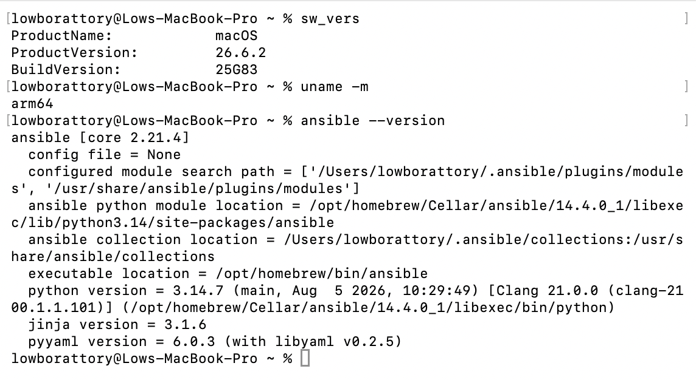

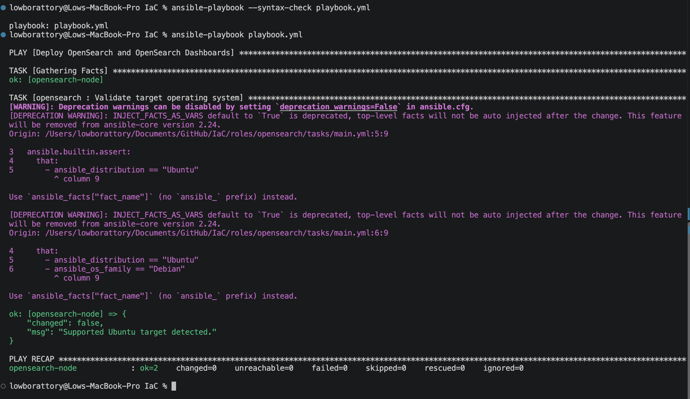

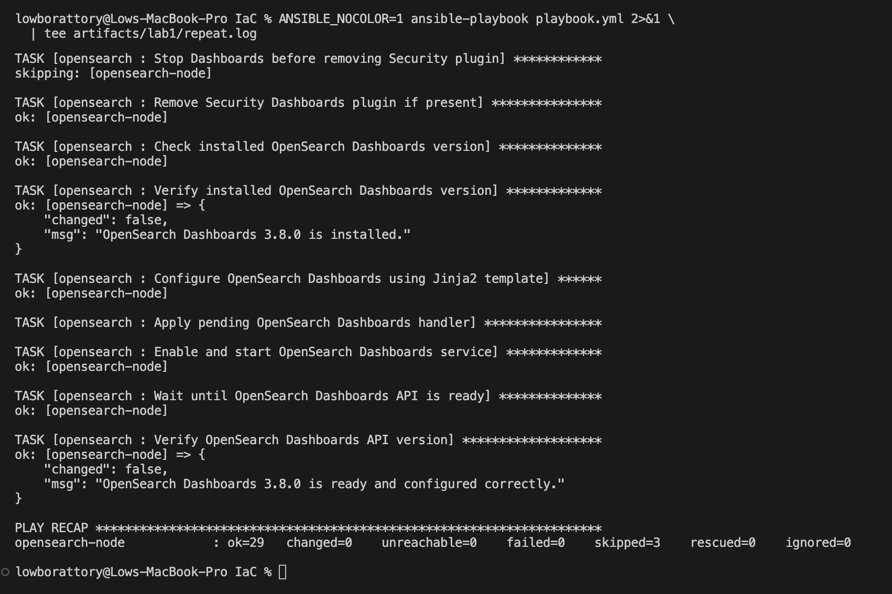
